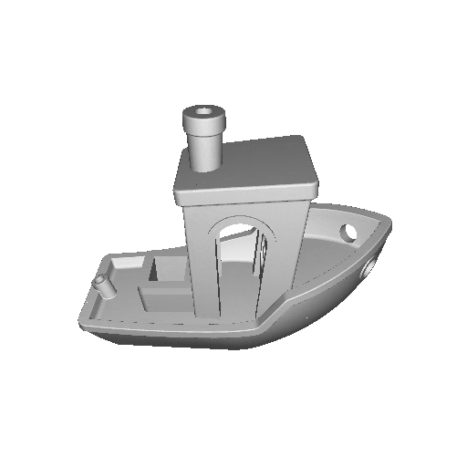

# Discord 3d model gif bot

Converts posted 3d models in a discord channel (stl/3mf/obj/gcode/step) into a .gif that is posted in the same channel.

When invited to a guild, posted 3d models will be converted to a .gif and this gif will be posted to the same channel.

When installed to the user, a message can be right clicked, and a .gif can be generated under the apps section.



## Setup

Docker compose example:
```yml
services:
  discordmodelgifbot:
    image: ghcr.io/suchmememanyskill/discord-model-gif-bot:latest
    restart: unless-stopped
    environment:
      - DISCORD_TOKEN=${TOKEN}
```

### Environment variables

Variable | Default value | Value type | Description
---|---|---|---
DISCORD_TOKEN | None | String | Discord token. Required.
FRAMES_PER_SECOND | 11.0 | Float | Playback speed in frames per second for the output .gif
FRAMES | 88 | Integer | Amount of frames generates
DELETE_OLD_INTERACTIONS | false | Boolean | Deletes old interactions before initialisation. Set this to `true` if the right click apps interaction doesn't show up